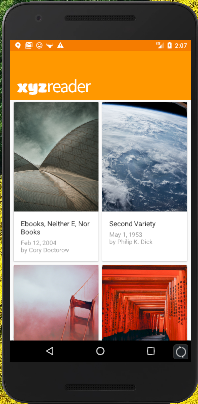
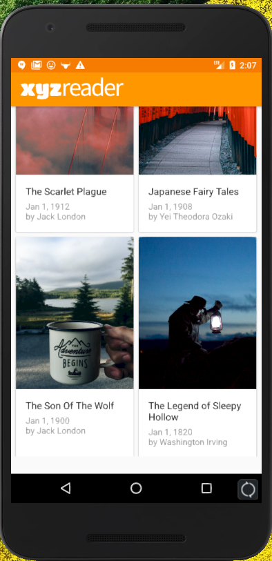
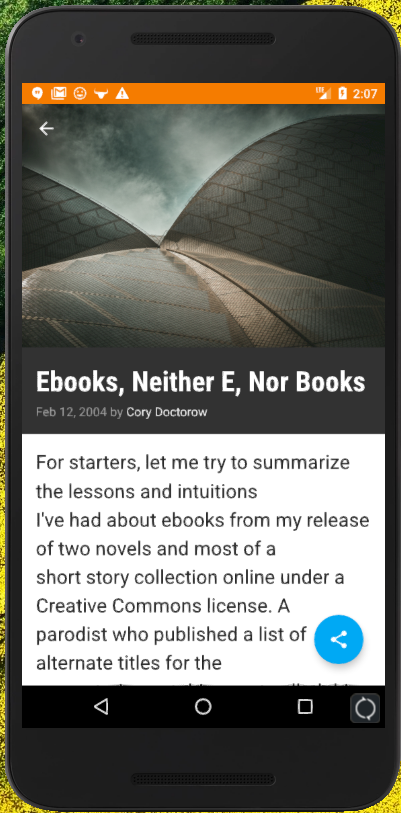
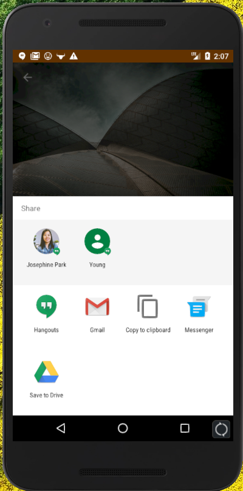

# XYZReader
XYZReader is an android application that displays articles.  
An emphasis was put on material design guidelines.  
 
The main screen displays lists of items in a grid format:  
  
 
A coordinator layout allows the toolbar to collapse upon scrolling:  

 
Clicking on an article brings you to to full article:  

 
Share article with friends:  
  
 
Thank you for reading!  
Any suggestions will be greatly appreciated!  
